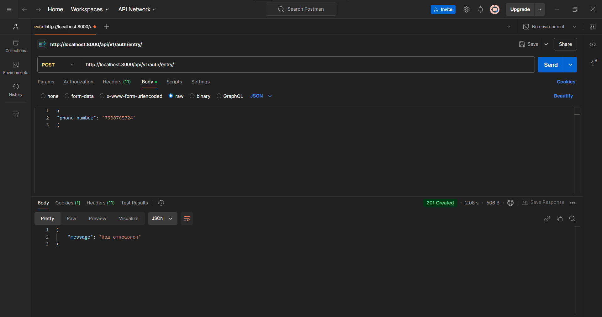

# Hammer Systems API

## Стек технологий

- **Backend**: Django, Django REST Framework
- **База данных**: PostgreSQL
- **Аутентификация**: JWT
- **Контейнеризация**: Docker
- **Документация API**: drf-yasg

# Установка

   ```bash
   git clone https://github.com/agapoov/HammerSystems.git
   cd hammer_systems
   ```

   ```bash
   cp .env.example .env
   ```

   ```bash
   docker-compose up --build
   ```

   ```bash
   docker-compose exec web python backend/manage.py migrate
   docker-compose exec web python backend/manage.py createsuperuser
   ```

Пример содержимого `.env`:
```env
DATABASE_NAME=<db_name>
DATABASE_USER=<user>
DATABASE_PASSWORD=<password>
DATABASE_HOST=db # Или localhost не для Docker
DATABASE_PORT=5432
```
Заполните .env

# Функционал

Документация для API доступна по адресу: http://localhost:8000/redoc/ или http://localhost:8000/swagger/

Основные эндпоинты:

- **http://localhost:8000/api/v1/auth/entry/**: Используется для ввода номера телефона и генерации кода, а так же передачи номера телефона в сессию, для последущей верификации. Если пользователь с таким номером не существует, он создается.
  ```json
  {
    "phone_number": "79087777777"
  }
  ```
- **http://localhost:8000/api/v1/auth/verify/**: Используется для подтверждения по коду. Номер телефона хранится в сессии Для простоты код хранится в БД, а после входа удаляется, но я бы лучше использовал сессии. Так же, выдаются access_token и refresh_token.
  ```json
  {
    "code": 1234
  }
  ```
- **http://localhost:8000/api/v1/profile**: GET выводит номер телефона пользователя, его код для приглашения, код который он активировал, и пользователи которые ввели его код.
  ```json
  {
    "phone_number": "79087777777",
    "invite_code": 283817,
    "activated_code": null,
    "referred_users": [
      "79907618723",
      "7651249834"
    ]
  }
  ```
- **http://localhost:8000/api/v1/profile**: POST запрашивает invite_code, проверяет что пользователь еще не вводил код, что это не его код, и сохраняет.
  ```json
  {
    "invite_code": "283817"
  }
  ```
- **http://localhost:8000/api/token/refresh/**: Принимает refresh_token и возвращает новый access_token. Срок жизни access_token —  1 час, refresh_token —  7 дней
  ```json
  {
    "refresh": "string",
    "access": "string"
  }
  ```
- **http://localhost:8000/api/token/verify/**: Для проверки подлинности токена
  ```json
  {
    "token": "string"
  }
  ```
  
# Скрины




